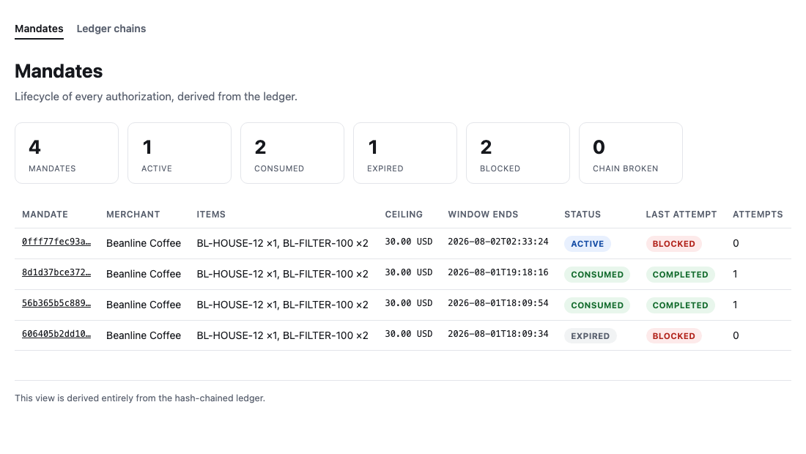
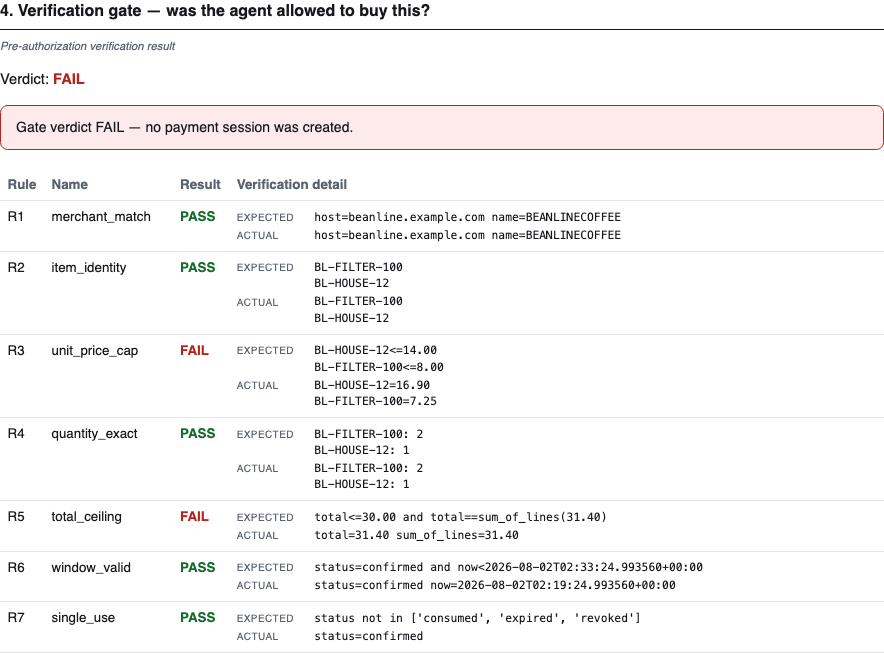
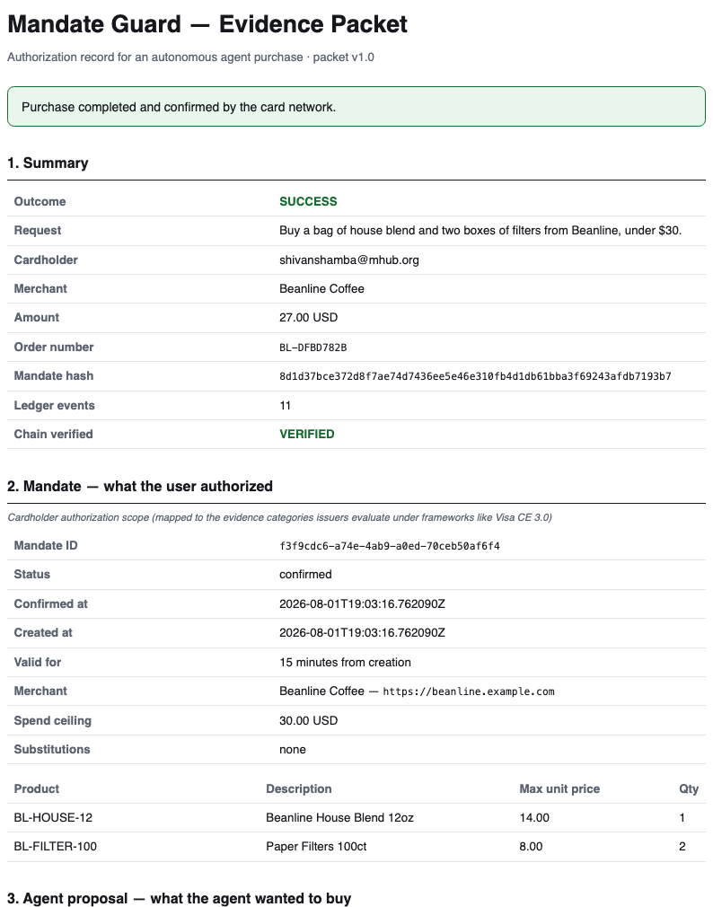
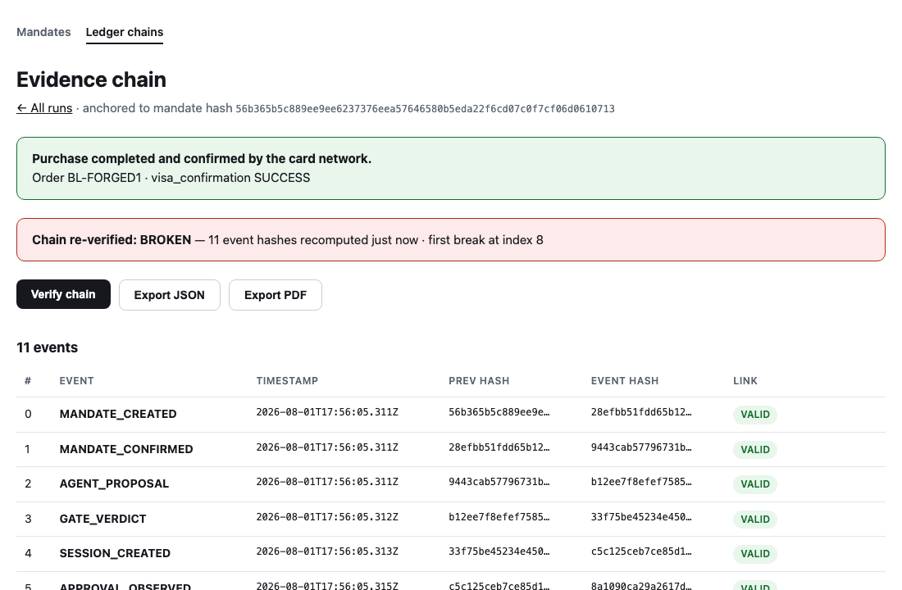

# Mandate Guard by Rakesh

**Mandate Guard decides *whether* an agent may pay; Prava enforces *how* it pays; the hash-chained
ledger proves both happened — and exports the evidence packet an issuer, merchant, or finance team
consumes when an agent purchase is contested.**

Everyone else is teaching agents to spend money. Mandate Guard is built for the day a purchase gets
contested.

> ### Evaluating this in 90 seconds
>
> 1. **Demo video** — _(link added at submission)_
> 2. **The artifact** — [flagship evidence packet (PDF)](evidence/sample/evidence-packet.pdf), from a
>    real Prava sandbox purchase.
> 3. **One command, no keys required:**
>    ```
>    .venv/bin/python scripts/run_demo.py blocked --no-llm
>    ```
>    Watch the gate refuse a drifted cart and export evidence of the refusal.

---

## The problem

An agent can hold a payment credential and complete a checkout. Nothing in that flow records what
the *user* actually authorized. When the charge is questioned a week later — wrong item, wrong
price, padded fees, a merchant nobody approved — there is no artifact that says what the agent was
permitted to buy, who approved it, or whether the cart matched.

Card networks already have a dispute-evidence process. Agent purchases arrive at it with nothing to
submit.

## What this does

1. **Compiles a mandate.** A natural-language request becomes a confirmed, hash-anchored authorization:
   this merchant, these products, these per-item price caps, this total ceiling, this time window.
   The user confirms it before it is hashed.
2. **Verifies before paying.** A shopping agent proposes a cart. Seven deterministic rules check the
   proposal against the mandate. A FAIL is terminal: **no payment session is ever created**, so no
   credential is ever minted.
3. **Re-verifies at the point of sale.** Immediately before any card number is typed, three more
   checks run against the rendered checkout page.
4. **Records everything.** Every stage appends to an append-only, hash-chained ledger anchored to the
   mandate hash.
5. **Exports the artifact.** JSON and PDF evidence packets, with a labelled AI-written summary over a
   deterministic record.

## Architecture

```
User request (natural language)
  → Mandate Compiler      LLM extracts → code validates → user confirms → SHA-256 hash
  → Shopping Agent        proposes a cart; holds no credentials, cannot call Prava
  → Verification Gate     R1–R7, pure functions, PASS/FAIL per named rule
  → (PASS only) Prava     session → hosted card entry → passkey → one-time credentials
  → Checkout Executor     E1–E3 pre-check → Playwright fills the merchant checkout
  → report-status         APPROVED / DECLINED → visa_confirmation
  → Evidence Ledger       append-only, hash-chained, every stage
  → Evidence Export       JSON + PDF, deterministic facts + labelled AI narrative
  → Lifecycle Dashboard   mandate status and attempt history
```

Two independent verification points: the **gate**, before any Prava call, and the **executor
pre-check**, before the card number is typed.

**Fenced Generation.** LLM calls exist in exactly three places: extracting draft constraints from
natural language, writing the agent's one-sentence rationale, and writing the evidence narrative.
The gate, the executor, the ledger, and every payload builder are deterministic and unit-tested. A
model can describe a decision; it can never make one. Prices and totals are copied from the
merchant's catalogue by code, never written by a model.

**The lifecycle dashboard stores no state of its own.** Every field — mandate status, attempt
outcome, attempt count, summary totals — is derived from the hash-chained ledger on each request, so
the view cannot disagree with the record it describes. Status is computed, not stored: `EXPIRED` is
derived from the clock against the mandate's window, and the clock is injectable so the derivation is
testable. The page says so in its own footer.



Mandate status and attempt outcome are separate axes, and the separation is the product: a **BLOCKED**
attempt leaves the mandate **ACTIVE**, because the gate refused a specific cart without spending the
user's authorization. Only an approved charge consumes it.

## The rule set

The gate, before any payment session exists:

| Rule | Name | Check |
|---|---|---|
| R1 | `merchant_match` | Proposal host equals the mandate merchant host; names match after Visa-safe sanitization |
| R2 | `item_identity` | Exact product-id match both ways — no substitutions, no extras, no omissions |
| R3 | `unit_price_cap` | Every unit price is at or under the cap the user approved for that product |
| R4 | `quantity_exact` | Quantities match the mandate exactly |
| R5 | `total_ceiling` | Total is under the ceiling **and** equals the sum of the lines |
| R6 | `window_valid` | Mandate is confirmed and still inside its effective window |
| R7 | `single_use` | Mandate is not already consumed, revoked, or expired |

The executor pre-check, against the rendered page, before card entry:

| Check | Name | Check |
|---|---|---|
| E1 | `page_total_matches_session` | The page charges exactly what Prava authorized |
| E2 | `storefront_host_matches_declared_origin` | We are still on the merchant the user named |
| E3 | `page_items_match_proposal` | The cart on screen is the cart the gate verified |

Rules never short-circuit: a proposal that breaks three rules reports all three, to the ledger and
to the UI. Where a rule cannot verify something — a line item with no mandate counterpart has no
price cap to check against — it **fails**. Unverifiable is not the same as fine.

A blocked run, as the evidence packet renders it — every rule reported, the failures named:



**R5 is deliberately stricter than the payment API.** Prava's `create-session` explicitly permits
`total_amount` to exceed the sum of line items, so merchants can add tax, shipping, and fees. That
slack is correct for the network and wrong for an authorization check: padded "fees" are a primary
drift vector — the cart the user approved, charged at a number they never saw. R5 closes it.

## Quickstart

```bash
python3 -m venv .venv
.venv/bin/pip install -r requirements.txt
.venv/bin/playwright install chromium          # browser binary, separate download
```

**Keys.** None are needed for the default demo — it runs fully offline against `fake_prava` with
`--no-llm`. `OPENAI_API_KEY` in `.env` is only for the live LLM narrative and agent rationale;
`PRAVA_SECRET_KEY` is only for `--prava real`. A fresh clone with no `.env` runs everything below.

Run the two scenarios. Both run entirely locally against `fake_prava` and spend no sandbox quota:

```bash
.venv/bin/python scripts/run_demo.py happy --no-llm     # purchase completes
.venv/bin/python scripts/run_demo.py blocked --no-llm   # gate blocks it; no session is created
```

Drop `--no-llm` to use the real model for the agent rationale and the evidence narrative; that needs
`OPENAI_API_KEY`.

Each writes an evidence packet to `evidence/demo/` and persists the ledger to `evidence/ledgers/`.

Browse the results:

```bash
.venv/bin/uvicorn ledger_ui.app:app --port 8300
```

| Route | What it shows |
|---|---|
| `/mandates` | Lifecycle dashboard — status, last-attempt outcome, attempt count per mandate |
| `/mandates/{hash}` | One mandate: authorized scope, attempt history, lifecycle timeline, evidence links |
| `/` | Ledger chains — every event with per-link verification |
| `/ledger/{id}` | One chain, with a **Verify chain** button that recomputes every hash on click |

The demo merchant, if you want it standalone:

```bash
.venv/bin/uvicorn storefront.app:app --port 8200      # /_admin has the drift toggle
```

Tests:

```bash
.venv/bin/python -m pytest tests/ -q                  # 345 tests
```

### Against the real Prava sandbox

Requires your own Prava sandbox keys (`PRAVA_SECRET_KEY`, `PRAVA_BASE_URL`) in `.env`. Opt in per
invocation. This spends one sandbox session and needs a human to complete card entry, the issuer OTP,
and the passkey at the printed `iframe_url`:

```bash
.venv/bin/python scripts/run_demo.py happy --prava real --storefront-port 8200
```

The default is always `fake_prava`; `real` is a flag on the command, never a change to `.env`, so no
test or later run can inherit it.

## Evidence packet

[**evidence-packet.pdf**](evidence/sample/evidence-packet.pdf) ·
[**evidence-packet.json**](evidence/sample/evidence-packet.json) — from a **real Prava sandbox run**: session
`ses_01KYZBDEGN8P1HWEWC2X585Z0T`, `visa_confirmation: SUCCESS`, storefront order `BL-DFBD782B`,
11 ledger events, chain verifies. Both JSON and PDF are rendered from the same assembled object, so
they cannot disagree.

The PDF runs: summary → mandate → agent proposal → gate verdict table → payment session scope with
`external_order_ref` → masked credential record → point-of-sale re-verification → checkout proof
with screenshot → outcome reported to the network → chain verification → labelled AI narrative.

The narrative is the only generated prose in the packet and is labelled *"Narrative (AI-generated
summary of the deterministic record below)"*. From the flagship packet, verbatim:

> Record shows a completed purchase: buy a bag of house blend and two boxes of filters from Beanline
> Coffee for under $30 (USD). Order number: BL-DFBD782B.
>
> Authorization and screening details: gateway verdict = PASS; Visa confirmation = SUCCESS; no failed
> rules listed; chain_valid = true.
>
> […]

Fields are annotated as **mapped to the evidence categories issuers evaluate under frameworks like
Visa CE 3.0**. This is not a CE 3.0 packet and is not described as one.



## Credential handling

Full payment tokens and dynamic CVVs exist in memory only. They are never persisted, logged,
screenshotted, committed, or included in an evidence packet. The ledger stores the token's last four
digits, its expiry, and the transaction reference — nothing more, and it *refuses* a payload
containing a credential field rather than trusting the caller. Playwright tracing is disabled for the
entire executor run, because a trace would capture the typed values. No sandbox test card number
appears anywhere in this repository.

## Demo merchant

The merchant is a self-hosted storefront, disclosed openly in [DISCLOSURE.md](DISCLOSURE.md).
Sandbox-issued credentials cannot clear a real merchant's processor, so a test merchant is required;
Prava support confirmed that a clearly disclosed self-built storefront is acceptable. Every
Prava-side step is real sandbox: session creation, passkey approval, credential issuance,
`report-status`, and the returned Visa confirmation.

The storefront's **drift toggle** perturbs the *merchant* — it raises a price or swaps a product —
and renders a visible `SIMULATED …` banner while active. It never touches the agent's output: the
agent genuinely reads the drifted price, and the gate genuinely catches it. Nothing about the failure
demo is staged.

## What we learned

**Evidence-first architecture meant the dashboard needed no state of its own.** Once every stage
writes to a hash-chained ledger, the lifecycle view is a pure projection of it — status, attempt
history, and totals are all derived on read. There is no second place for the truth to live, so
there is no way for the UI to drift from the record.

**The docs and the API disagreed, and the API won.** Building against the vendor's sandbox surfaced
behaviour documented nowhere:

- `409 DUPLICATE_EXTERNAL_ORDER_REF` — `external_order_ref` is a permanent per-merchant idempotency
  key. Our first design used the bare mandate hash, which would have allowed exactly one payment
  session per mandate *for all time*: no retry after a failed passkey, no retry after a decline. The
  mapping became `{mandate_hash}.{attempt:02d}`, and the attempt number is now itself evidence.
- `AUTH_FAILED` as a transaction-level error when a passkey or OTP fails, terminal, with no
  credentials issued.
- One session can accumulate several transactions, so credentials must be read from the newest.
- `transactions[].status` can disagree with `line_items[].status` — a `failed` transaction held a
  `pending` line item. Credential-readiness has to key off token presence, never a status field.
- The `processing` status is real, though one reference page omits it from its enum. A poller that
  treated an unlisted status as fatal would have failed our live run.

**A poller must not be more impatient than the thing it polls.** Our first version used a fixed
timeout shorter than the session lifetime, which manufactures false failures while a session is
still payable. Polling is free; the session's own `expires_at` is the only real deadline. First-time
passkey enrolment took long enough that the fixed timeout would have abandoned a successful run.

**Verification logic belongs outside the browser.** The executor observes the page and types into it;
every decision is made by pure functions over a plain dict. The same logic is unit-tested without a
browser and drives the real one unchanged.

Clicking **Verify chain** rehashes every event from disk, so an edited ledger turns red without a
restart — the content banner still shows what the file claims, and the chain says whether to believe it:



**Tests that check presence do not check correctness.** Our evidence PDF rendered an intact hash
chain in the colour of failure, and prices wrapped mid-number across a column break. Both passed
every assertion we had, because the assertions checked that content existed. Some defects are only
visible by looking at the artifact.

## Positioning

**"Prava already has Guardrails — why this?"** Guardrails are account and agent-level spend controls
enforced at payment time. Mandate Guard verifies per-purchase *intent fidelity* — this specific cart
against this user's confirmed mandate — before a session exists, and produces the exportable
dispute-evidence artifact afterward. Their controls constrain spend; ours proves authorization.

**"Prava's Browser Harness already confirms the true total before charging."** It does — at charge
time, against the order. Mandate Guard verifies against the user's *mandate*, upstream of session
creation, and records the whole chain as evidence. Our executor pre-check mirroring their harness is
convergent design, and we say so.

**"Isn't the total already checked by the payment API?"** No — `create-session` explicitly allows
`total_amount` to exceed the line-item sum, and it should, because legitimate carts need that slack.
R5 is stricter on purpose. See the rule set above.

**"Won't AP2 solve this?"** AP2 specifies mandate data formats but needs ecosystem-wide adoption and
ships no adjudication artifact. Mandate Guard works today on card rails via Prava; when AP2 matures
the ledger maps onto its mandate objects — an evidence layer on top of the protocol, not a competitor
to it.

## Where the tracks map

- **Open** — the whole system: mandate compiler, verification gate, hash-chained ledger, executor, and evidence export.
- **OpenAI** — the three fenced model uses: constraint extraction, agent rationale, and the evidence narrative. The model name is recorded in the packet itself, under "Agent model".
- **Visa** — the rule set and the passkey-approved payment flow, with evidence mapped to the categories issuers evaluate.
- **Localhost** — the Positioning and Future work sections, and the production-access path for a real completed purchase.

## Future work

- **The gate is transport-agnostic.** In production the same verification and ledger sit behind an
  MCP tool interface, so agents are handed Mandate Guard instead of payment credentials.
- **Standing mandates.** Prava supports mandates that are approved once by passkey and charged later
  with no passkey per charge. That is the regime where this matters most: the gate and the ledger
  become the only per-charge control. Every `mandate-charge` would be gated exactly as sessions are.
- **Substitution policy.** v1 requires exact product-id matches. A `same_product_line` policy with a
  fixed deterministic similarity threshold is the natural next rule.
- **Tax and shipping.** R5 requires the total to equal the sum of the lines, which the demo merchant
  satisfies because it charges neither. Real carts need a declared, bounded allowance rather than
  slack.
- **Postgres-backed ledger.** The chain logic is storage-agnostic; the same `{mandate_hash, events}`
  shape moves into a table without the hashing rules changing.

## Repository layout

```
backend/
  compiler/     mandate extraction (LLM) + deterministic validation + hashing
  gate/         R1–R7 verification rules and verdict
  ledger/       hash chain, persistence, lifecycle projection
  prava_client/ Prava REST client with expiry-bounded polling
  executor/     E1–E3 pre-check and the Playwright checkout runner
  export/       evidence packet assembly, HTML rendering, print-to-PDF
  agent/        shopping agent
  orchestrator.py  the full flow, one readable file
storefront/     demo merchant + mock processor + drift toggle
ledger_ui/      lifecycle dashboard and ledger browser
fake_prava/     local stand-in for the Prava endpoints, built from observed responses
scripts/        demo runners and the sample-packet generator
evidence/       rules clearance, sample packet
tests/
SPEC.md · DISCLOSURE.md
```

`fake_prava/` reproduces the undocumented behaviours listed above, including the 409, so the retry
logic is exercised locally instead of failing against the real sandbox. It never appears in the demo.
